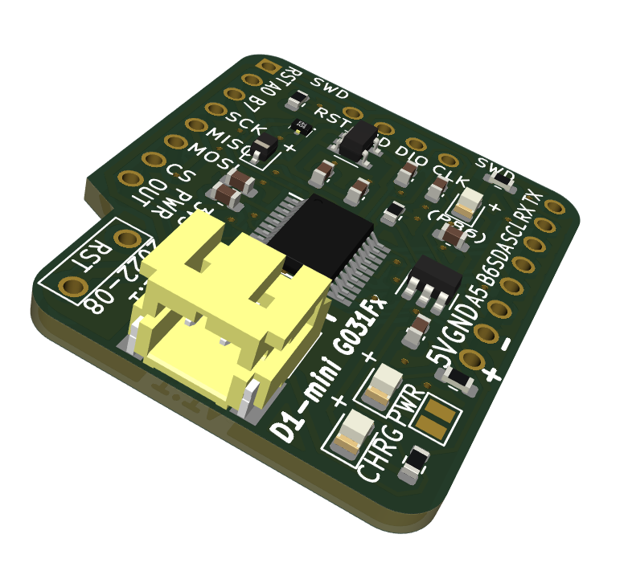

# The D1-mini G031Fx Development Board

## Why try this board?

This board allows for a gentle introduction to embedded software development in the `Arduino IDE C/C?++ speak` and progressing further with `STM32Cube IDE` and unleashing the power of the ARM processor architecture. The development board's educational purpose is to be `as simple as it can, but not simpler` (*Albert Einstein*). There is still much to explore with this affordable board and a modest investment in the debugger/programmer. The software development tools are free and use Linux. The operating system is at no additional cost.

- It is cheap to get started. $5 should be enough, excluding the computer.
- It is easy to extend capabilities by adding [Wemos/Lolin](https://lolin.aliexpress.com/store/1331105) shields to the board.
- Explore advanced low-power modes.
- Interface various sensors.
- Explore capabilities and limitations.
- Design your shields to be mounted on top of the board.

The last point can be an introduction to designing custom boards with [KiCad](https://www.kicad.org).

## Development Boards main features

The development board use STMicroelectronics STM32G031FxP microcontroller, an ARM STM32 Microcontroller in the `TSSOP20` package. 

- Core: ARM Cortex M0+.
- Flash size (G031F8): 64 kB.
- Flash size (G031F6): 32 kB.
- Max clock frequency: 64 MHz.
- ADC Resolution: 12 bit.
- The number of I/Os: 18 I/O.
- Data RAM Size: 8 kB.
- Supply voltage: 1.7-3.6 V.
- Temp. range: -40.. +85 C.
- Interface Type: I2C, USART, UART, SPI.
- Low-power modes: Sleep, Stop, Standby, and Shutdown.
- Development support: serial wire debug (SWD).

The development board includes a LiPo-charger and connector for a 3.7 V connection in the field. The form factor is the `Wemos/Lolin D1-mini` and thus can often directly accept their series of shields.
One LED indicates `power`, which can be disabled to reduce power consumption, a second LED shows charging status, and the third is the user `LED_BUILTIN` (=PB8).

## Software development

[STM32Cube IDE](https://www.st.com/en/development-tools/stm32cubeide.html) with [ST-LINK/V2](https://www.st.com/en/development-tools/st-link-v2.html) in-circuit debugger/programmer can be used for C/C++ code development. There are cheap alternative ST-Link adapters (AliExpress/Amazon). It is also possible to use STMicroelectronics `Discovery boards`, which come with built-in debugger probes.

Another alternative is to use a gentler approach with [Arduino IDE](https://www.arduino.cc/en/software) and program the board with an ST-link and the Arduino library `stm32duino`, which is officially supported by STMicroelectronics.

## Specification for the D1-mini G031Fx Development board v1.1

The fabricated two-layer board has the dimensions of 26.8 x 31.6 mm (1.05"x1.24").

| parameter | imperial | metric |
| -----------|-------|------|
| board material | FR4 | FR4 |
| board thickness | 39 mil | 1.0 mm |
| surface finish | HASL | HASL |
| copper layer thickness | 1.4 mil | 35 um |
| board color | black | black |
| board text | white | white |
| board weight | 2.82 oz | 80 gram |

Printed circuit boards use Hot air solder leveling (*HASL*).

## The board is fully assembled and tested

The `D1-mini G031Fx` development board is available only fully assembled.

## Purchase the board
Find all the latest designed boards on `Tindie`. 

I appreciate your support.